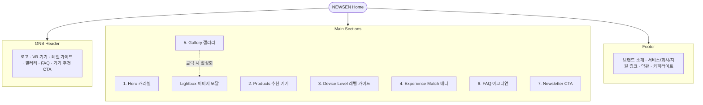

# 🥽 NEWSEN(뉴센) VR 기기 추천 플랫폼

나에게 맞는 VR 기기를 찾아주는 **원페이지(One-page) 반응형 랜딩 플랫폼**입니다. 입문·중급·전문가 레벨 가이드와 제품 큐레이션을 통해 VR 초보자의 선택 장벽을 낮춥니다.

**Live:** https://lhn-rag.github.io/NEWSEN/

---

# 🛠 기술 스택

- **Frontend**
  - HTML5
  - CSS3 (Custom Properties / Pretendard)
  - Vanilla JavaScript

- **Design & Motion**
  - CSS3 Custom Animation
  - Bounce / Card Lift Hover
  - Slide Carousel Transition

---

# 📌 정보 구조도 (Information Architecture)

---

# ⚙️ 주요 기능 및 인터랙션

## 1. 반응형 이미지 캐러셀 (Hero Carousel)

### 기능

- 5초 간격 자동 재생
- `translateX` 슬라이드 전환 효과
- 이전 / 다음 버튼 제공
- 하단 닷 인디케이터 클릭 이동
- 키보드 ← / → 지원
- 사용자 조작 시 자동 재생 인터벌 초기화

### 반응형

- Mobile / Tablet / Desktop 타이포·레이아웃 대응
- Sticky 헤더 + 모바일 햄버거 메뉴

---

## 2. FAQ 아코디언 (Accordion)

### 동작

- 질문 클릭 시 해당 답변 영역 펼침 / 접힘
- 한 번에 하나의 항목만 열림
- `aria-expanded`로 접근성 상태 동기화

### 애니메이션

- `max-height` 전환
- 셰브론 아이콘 180° 회전

---

## 3. 라이트박스 이미지 모달 (Lightbox Modal)

### 동작

- 갤러리 썸네일 클릭 시 모달 오픈

### 애니메이션

- Fade-In + Scale-In
- `opacity` / `transform`

### UX

- 모달 활성화 시 Body Scroll Lock
- 오버레이(외부) 클릭 시 닫힘
- `ESC` 키 입력 시 닫힘

---

## 4. 뉴스레터 구독 폼 (Newsletter)

### 검증

- HTML5 `type="email"` + `required`

### 제출 완료

- 유효한 이메일 제출 시
- 폼 숨김
- 성공 피드백 카드 노출

---

## 5. 시각적 피드백 및 모션 효과

### Bounce 버튼 (`.btn-bounce`)

- `cubic-bezier`
- Hover / Active 상태에서 스프링처럼 튀는 스케일 애니메이션

### Card Lift (`.card-lift`)

- Hover 시 카드가 살짝 떠오르며 그림자·미세 회전 피드백 제공

### Sticky Header

- 스크롤 24px 이상 시 반투명 + `backdrop-filter` blur

---

# 🎨 디자인 가이드 (Color System)

| 구분 | 색상 | 용도 |
|------|------|------|
| **Primary** | `#4338CA` | 메인 브랜드 퍼플, CTA 버튼, 강조 포인트 |
| **Secondary** | `#E8E5FF` | Experience Match 등 라이트 섹션 배경 |
| **Success** | `#17C7B7` | 배지, 레벨 강조, 포인트 컬러 |
| **Success Light** | `#D9F8F4` | 성공/입문 톤 배경 |
| **BG Dark** | `#15142A` | 헤더, Hero, 레벨 섹션, 푸터 |
| **BG Light** | `#FAFAFA` | 기본 페이지·카드 배경 |
| **Text Dark** | `#18181B` | 본문 텍스트 |
| **Border** | `#D4D4D8` | 카드·구분선 |

---

# 📱 반응형 지원

- Desktop (`1025px+`)
- Tablet (`481px ~ 1024px`)
- Mobile (`~480px`)

---

# ✨ 핵심 UX 포인트

- 원페이지 스크롤 기반 VR 추천 랜딩 페이지
- 입문 / 중급 / 전문가 레벨 가이드로 선택 부담 완화
- 캐러셀·갤러리·FAQ 등 인터랙션 중심 UI
- 라이트박스로 이미지 탐색 경험 강화
- Bounce / Card Lift 모션으로 터치·클릭 피드백 제공
- Mobile 햄버거 메뉴 및 반응형 그리드 레이아웃 지원
